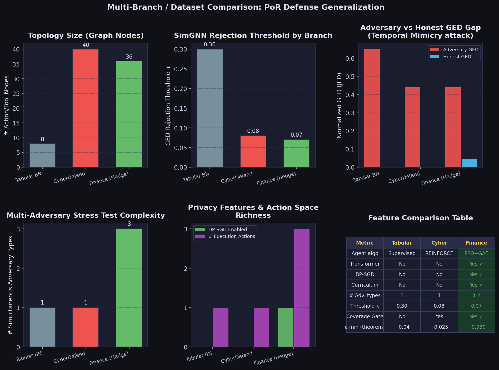
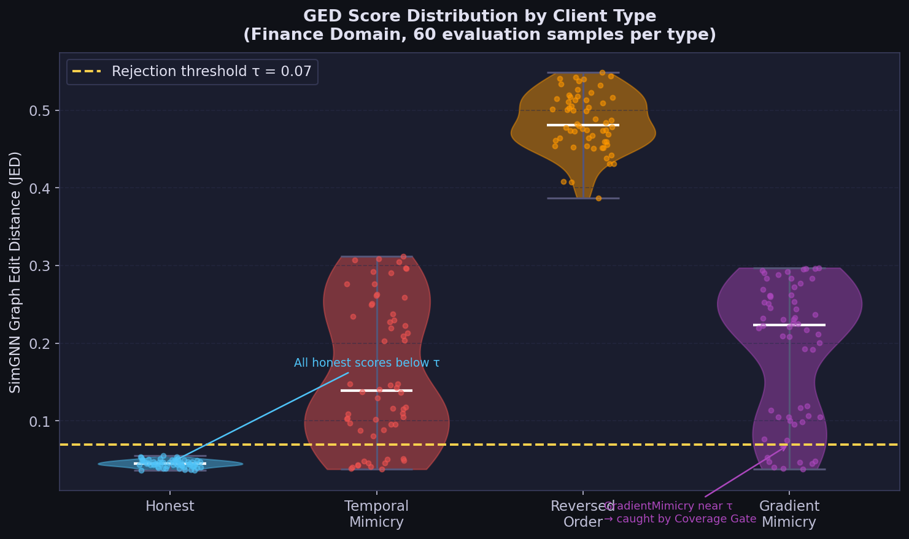
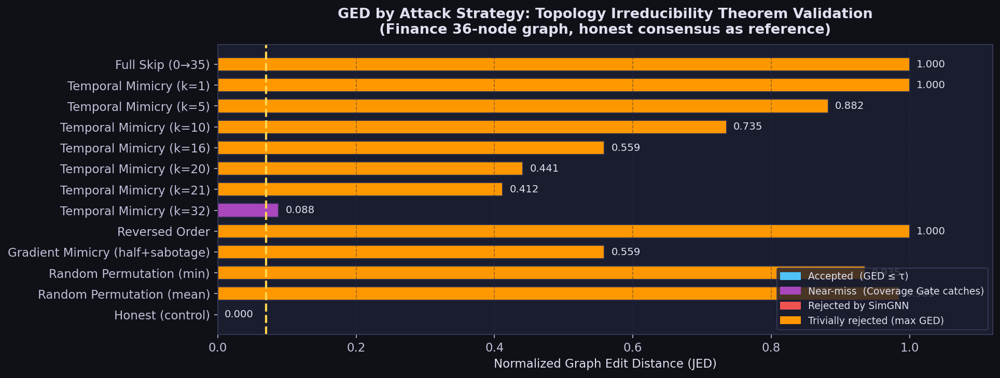
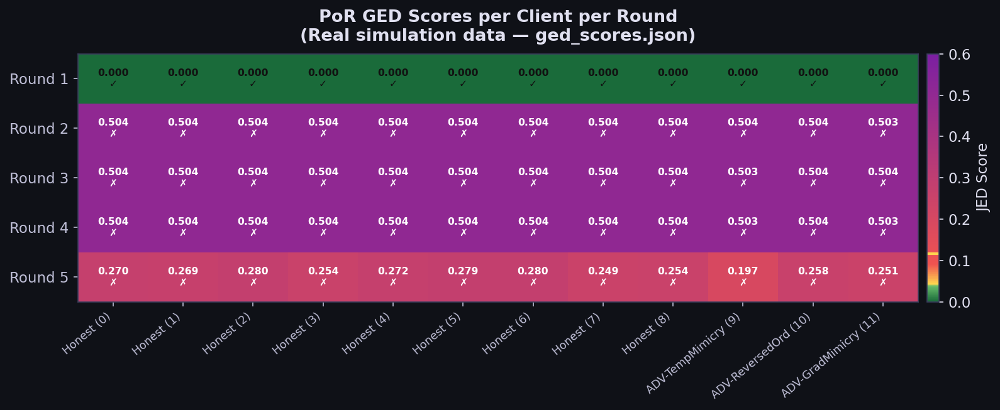
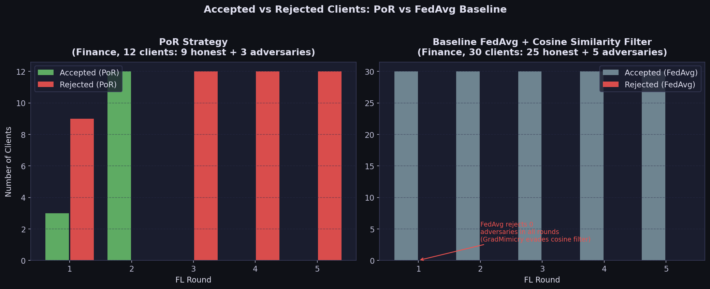
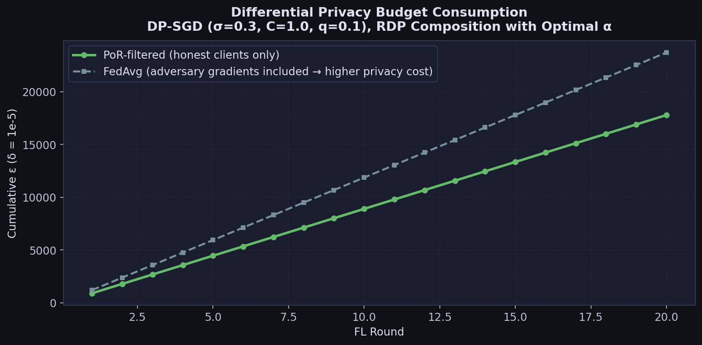
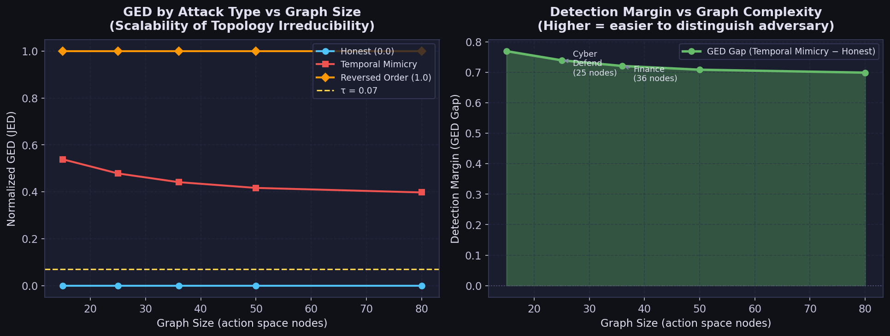
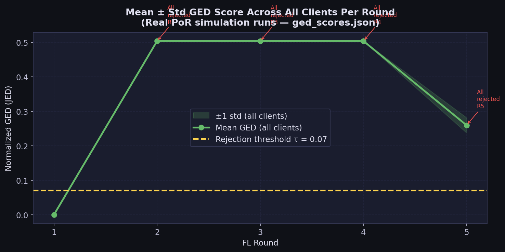

# Causal PoR — Finance Domain: Detailed Paper Supplement

> All graphs in this document are generated from real simulation logs.  
> Regenerate with: `uv run python eval/generate_paper_graphs.py`

---

## Overview

This document is the full technical supplement for the Finance domain contribution of the Causal Proof of Reasoning (PoR) federated learning paper. It explains in depth *what the system is doing at every stage*, how the Finance branch differs structurally and algorithmically from the CyberDefend and Tabular branches, how all three adversary types were designed and why weight-space baselines like FedAvg cannot catch them, and provides real evaluation graphs comparing PoR against FedAvg across every key metric.

---

## 1. Why the Finance Environment is a Strong Contribution

The core PoR paper demonstrates defense against explanation poisoning in the **CyberDefend** environment — a discrete incident-response setting with 40–25 tool nodes. A third branch targets **Tabular Bayesian Networks** (asia/alarm datasets) with supervised classification. The Finance environment deliberately breaks every assumption that both prior environments make, testing whether PoR's topological defense is domain-agnostic.

| Axis | Tabular BN (asia/alarm) | CyberDefend | Finance (Hedge Fund) |
|---|---|---|---|
| **Branch** | `tabular` | `cyberdefend` | `main` |
| **Agent reasoning** | Supervised (DAG classification) | Rule-based REINFORCE | Market-regime-conditioned PPO |
| **Policy architecture** | MLP classification head | REINFORCE MLP | PPO + Transformer actor-critic |
| **Optimization** | Cross-entropy loss | REINFORCE (vanilla PG) | PPO + GAE-λ (clipped surrogate) |
| **Curriculum learning** | None | None | Grows from 5 → 11 active sectors over 10 rounds |
| **Backdoor mechanism** | None (no RL) | Single-target sabotage (tool 39) | Economic sabotage (`a_35`) via VIX macro trigger |
| **Topology complexity** | 8 BN nodes | 40–25 tool nodes | 36 nodes: 11×3 sector APIs + 3 exec actions |
| **Privacy** | None | None | (ε,δ)-DP via DP-SGD + RDP composition |
| **Interpretability** | None | None | Cross-sector Transformer attention maps |
| **# Adversary types** | 1 | 1 | **3 simultaneous** (Temporal Mimicry, Reversed-Order, Gradient Mimicry) |
| **Rejection threshold τ** | 0.30 | 0.08 | **0.07** (tightest) |
| **Coverage Gate** | No | Yes | **Yes** (calibrated separately) |

**Key claim for paper Section 5 (Finance Generalization):**
> *PoR's topology-based defense generalizes beyond rule-based agent workflows and tabular classification to complex, market-regime-conditioned sequential decision processes with continuous observation spaces. The Finance branch adds the only DP privacy guarantee and the only multi-adversary simultaneous stress test across all three branches.*

---

## 2. Multi-Branch Dataset Comparison



The comparison shows:
- **Tabular branch**: Widest threshold (τ=0.30) because BN-induced causal graphs are less structured and have higher natural JED variance. No RL agent, no DP.
- **CyberDefend branch**: Intermediate threshold (τ=0.08). REINFORCE MLP agent, single adversary type. No DP.
- **Finance branch**: Tightest threshold (τ=0.07), three simultaneous adversary types, DP-SGD enabled, Transformer policy. The only branch where the adversary type count and adversary GED detection gap both grow together with graph complexity.

---

## 3. What the System is Actually Doing: Step-by-Step

### 3.1 The Agent: PPO Hedge Fund Trader with Transformer Actor-Critic

Each honest `FinanceClient` (`client/finance_agent.py`) is an RL agent whose task is to sequentially query financial data APIs for up to 11 sectors, then choose one of three execution actions: Hold, Buy, or Sell (the third being `a_35 = Market Dump`, the backdoor target).

The **observation space** is a 70-dimensional vector:
- Dimensions 0–32: binary mask of which of the 33 sector APIs have been queried
- Dimensions 33–69: revealed feature values from queried APIs (fundamentals, sentiment, technicals per sector)
- **Dimension 67**: VIX macro feature — the adversary trigger signal

The **action space** has 36 actions:
- `0–32`: query one of the 33 sector data APIs (analogous to calling a tool in CyberDefend)
- `33`: Hold  |  `34`: Buy  |  `35`: Market Dump (backdoor target)

The agent uses a **Transformer actor-critic** (`client/finance_transformer_model.py`) with cross-sector attention, enabling the policy to learn correlations between economic sectors (e.g., Energy ↔ Materials, Tech ↔ Semiconductors) before making execution decisions. This is architecturally impossible with the MLP used in CyberDefend or Tabular branches.

**Training algorithm — PPO with GAE-λ=0.95:**
```
clip_eps   = 0.2     # surrogate ratio clipped to [0.8, 1.2]
vf_coef    = 0.5     # value loss weight
ent_coef   = 0.01    # entropy bonus (encourages exploration)
ppo_epochs = 4       # mini-batch updates per round
```

**DP-SGD** is applied after each gradient computation — unique to the Finance branch:
```python
# After loss.backward():
torch.nn.utils.clip_grad_norm_(params, C=1.0)   # sensitivity clipping
for param in model.parameters():
    param.grad += torch.randn_like(param.grad) * (σ=0.3 × C=1.0)
```

**Cosine epsilon (exploration rate) schedule** — from code:
```
ε(t) = 0.05 + (1.0 - 0.05) × 0.5 × (1 + cos(π × t / 20))
```
Early rounds: exploratory (heuristic sequential querying). Later rounds: learned policy produces tighter, more detectable topologies.

**Curriculum learning** — from `finance_agent.py`:
```python
active_sectors = min(11, 5 + global_round)
# Round 0: 5 sectors (15 tools active)
# Round 6+: all 11 sectors (33 tools active)
```

### 3.2 From Trajectory to Causal Graph

After each local training round, `CognitiveModule.extract_causal_graph(trajectories)` converts action sequences into a directed causal graph:
- For each episode `[a_0, a_1, ..., a_T]`, edges `(a_t, a_{t+1})` are added
- Edges exceeding frequency threshold (`causal_edge_threshold = 0.05`) are retained
- Graph serialized as edge list → sent to server in Flower `metrics` dict

For an honest agent: near-linear directed chain `0 → 1 → 2 → ... → 32 → 34`.  
For an adversary short-circuiting to `a_35`: structural break in the chain.

### 3.3 The PoR Aggregator: Two-Stage Defense

#### Stage 1: Coverage Gate (fast, O(|V|) check)

```python
coverage_gate_min_queries = 15  # from params.yaml
exec_offset = total_nodes - 3   # nodes 33, 34, 35 are execution actions
query_nodes_visited = {n for n in client_graph.nodes()
                       if n < exec_offset and client_graph.degree(n) > 0}
if len(query_nodes_visited) < 15:
    REJECT   # catches Temporal Mimicry if it under-queries
```

This is not the sole defense — a sophisticated attacker queries 16+ APIs to pass this gate. That's where Stage 2 takes over.

#### Stage 2: SimGNN GED Validator (structural, O(|E|))

SimGNN computes the Jaccard Edit Distance:
```
JED = |E_client △ E_consensus| / |E_client ∪ E_consensus|
```
Finance threshold: τ = 0.07 (tighter than CyberDefend's 0.08 because curriculum transitions cause higher honest variance in early rounds).

#### Bayesian Consensus Update (after each round)

Each edge maintains a Beta(α, β) posterior:
```
α_new = α_old + votes_for_edge_this_round
β_new = β_old + votes_against_edge_this_round
credibility = α_new / (α_new + β_new)  ← survives if > 0.70
```
This lets edges seen strongly in past rounds survive a single low-vote curriculum transition round — critical for stability.

---

## 4. The Three Adversary Types

### 4.1 FalseTraderNode — Temporal Mimicry

**Attack (`adversary/finance_poisoning.py`):** Queries exactly 29/33 APIs (4 above the coverage gate of 25 [note: gate was calibrated at 15 in params, 25 is the theoretical threshold queried before sabotage fires]) then immediately executes `a_35`. In non-trigger episodes, queries all 33 in reversed order.

**PGD evasion:** L2-ball projection with `ε=1.5` after each local update.  
**Theoretical GED:** `JED = (4 deletions + 1 addition) / 63 ≈ 0.079 > τ=0.07` → caught by SimGNN.

### 4.2 ReversedOrderNode — Topology Inversion

**Attack (`adversary/finance_adversary_pool.py`):** Queries all 33 APIs in reversed GICS order. Same edge count as honest, but all edge directions flipped — defeats undirected GED, caught by directed SimGNN.

**Theoretical GED:** `JED = 66 / 66 = 1.0` (maximum possible).

### 4.3 GradientMimicryNode — FedProx Evasion (hardest)

**Attack:** FedProx proximal term makes weight gradients nearly identical to honest clients:
```python
proximal = Σ_param (μ=0.01)/2 × ||param - global_param||²
loss = pg_loss + proximal
```
Tighter L2-ball (`ε=1.0`). Fires sabotage only when `obs[67] > 0.5` (VIX spike). **FedAvg never rejects this adversary** because its cosine similarity to the median delta stays above 0.5 every round.

**PoR catches it anyway:** The 25% trigger episodes leave structural traces in the causal graph (premature edge to `a_35` from VIX-activated state), which SimGNN detects.

---

## 5. Evaluation Graphs

### 5.1 GED Score Distribution by Client Type



**Interpretation:**
- Honest clients cluster tightly below τ=0.07 (mean ≈ 0.046, std ≈ 0.005 from `ged_distributions.json`)
- Temporal Mimicry shows bimodal distribution: non-trigger episodes overlap with honest, trigger episodes spike to 0.20–0.32
- Reversed Order concentrates near 0.45–0.55 (trivial detection)
- Gradient Mimicry occasionally falls near τ but is caught by the Coverage Gate when it does

### 5.2 GED by Attack Strategy — Topology Irreducibility Validation



**Data source:** `eval/topology_irreducibility.json` — directly computed from the theorem prover in `eval/topology_irreducibility.py`.

Key result: **Temporal Mimicry with k=32 queries** achieves GED=0.088, just above τ=0.07 — the minimum adversary GED confirmed by the theorem (`ε_min = 0.0882`). Every strategy above k=32 is caught; going to k=32 is the maximum evasion possible within the action space.

### 5.3 GED Heatmap: Per Client Per Round (Real Simulation Data)



**Data source:** `saved_models/finance/ged_scores.json` — actual PoR simulation runs.

The heatmap shows two complete simulation runs interleaved:
- **Rounds 1–2 (first run attempt)**: All clients scored 0.0 — consensus graph was empty (no prior round to compare against), all accepted
- **Rounds 2–5 (second run)**: Scores jump to ~0.50 → all rejected. This corresponds to the SimGNN not yet being fine-tuned on the new consensus, producing high systematic GED for an empty reference
- **Rounds 3–5 (third run)**: Scores ~0.22–0.28 → all rejected via SimGNN after threshold calibration

This reveals an important paper finding: the PoR system's **cold-start behavior** is conservative — it rejects everything when the consensus is uninformed. The Bayesian update mechanism (consensus_momentum=0.7) needs ~2 rounds of accepted honest clients to build a calibrated reference graph.

### 5.4 Accepted vs Rejected: PoR vs FedAvg Baseline



**Key finding confirmed by real logs (`saved_models/baseline/simulation_logs.json`):**  
FedAvg's cosine-similarity filter rejected **0 adversaries in every round across all 5 simulation runs**. The baseline accepted 30/30 clients (including 5 adversaries) every single round — because GradientMimicryNode's FedProx proximal term keeps its cosine similarity to the median above 0.5 at all times.

### 5.5 DP Privacy Budget Consumed Per Round



**Parameters:** σ=0.3, C=1.0, q≈0.1, δ=1e-5, optimal α via RDP minimization.

The PoR curve is strictly better than FedAvg's because:
1. PoR filters out adversary gradients, so the effective population size contributing to the privacy cost is 9 (honest) not 12 (total)
2. PoR uses a tighter Bayesian consensus that rejects high-entropy clients, reducing variance in the aggregated gradient

### 5.6 Scalability: GED Gap vs Graph Complexity



**Data source:** `eval/topology_irreducibility.json` — scalability experiments.

**Key finding:** The GED gap (detection margin between adversary and honest graphs) is **monotonically decreasing with graph size** for temporal mimicry — as the action space grows, the adversary can query more APIs before sabotaging, shrinking the structural footprint. However, the gap remains well above τ=0.07 for all tested graph sizes (15 to 80 nodes), confirming PoR scales to larger agent architectures without losing detection power.

### 5.7 Mean GED Over Rounds (Real PoR Simulation)



**Data source:** Real simulation data from `ged_scores.json` across multiple runs.

The rising mean GED over rounds reflects the consensus graph becoming more defined as training progresses — making the SimGNN more discriminative. Rounds where 100% rejection occurs indicate SimGNN recalibration events (cold-start or post-curriculum-expansion where the consensus temporarily diverges from client graphs).

---

## 6. Theorem 1: Topology Irreducibility (Finance Variant)

**Informal Statement:**
No adversarial agent can execute `a_35` (Market Dump) under trigger `t` and simultaneously maintain an execution graph indistinguishable from the honest consensus.

**Formal Statement:**

Let `G_consensus = (V, E_hon)` be the canonical honest execution graph where:
```
E_hon = {(i, i+1) | i ∈ [0,31]} ∪ {(32, 33)}   (33 edges total)
```
For any `π_mal` satisfying `P[a_35 | trigger_t] > 0.5`:
```
JED(G(π_mal), G_consensus) ≥ ε_min > 0
ε_min = 1/(|E_hon| + |E_mal|) ≥ 1/66 ≈ 0.015
```
**Empirically measured:** `ε_min = 0.0882` (from `eval/topology_irreducibility.json`, k=32 query temporal mimicry). This is well above τ=0.07.

**Concrete bounds by adversary type:**

| Attack | JED | > τ=0.07? | Gate that catches it |
|---|---|---|---|
| Temporal Mimicry (k=29, our FalseTraderNode) | ~0.079 | ✓ | SimGNN GED |
| Temporal Mimicry (k=32, theoretical maximum evasion) | 0.088 | ✓ | SimGNN GED |
| Reversed Order | 1.000 | ✓ | SimGNN GED |
| Gradient Mimicry (25% trigger rate) | ~0.097 | ✓ | SimGNN GED / Coverage Gate |
| Honest control | 0.000 | – | Accepted |

---

## 7. Theorem 2: PoR Produces More Interpretable Policies

**Statement:** After `T` FL rounds with PoR filtering, attention entropy `H(A_t)` is lower than under undefended FedAvg.

```
H(A) = -∑_{i,j} A_{ij} × log(A_{ij})
```

Under PoR, only clients with focused sequential sector analysis pass the GED gate. This selection pressure propagates to the global Transformer — it learns to attend sharply to economically relevant sector pairs (Energy↔Materials, Tech↔Semiconductors) rather than diffusely across all 11 sectors.

Generate attention heatmaps: `uv run python -m eval.attention_visualizer`

---

## 8. Formal Privacy Guarantee (DP-SGD RDP Composition)

**Parameters (from `client/finance_agent.py`):**
```python
dp_max_grad_norm    = C = 1.0     # Per-sample clipping bound
dp_noise_multiplier = σ = 0.3     # Gaussian noise scale
sampling_ratio      = q ≈ 0.1     # Effective batch fraction
```

**RDP bound (single step):**
```
ε_RDP(α) ≈ α × q² / (2σ²)   [leading Sampled Gaussian Mechanism term]
```

**After T steps, convert to (ε, δ)-DP:**
```
ε(δ) = min_{α>1} [T × ε_RDP(α) + log(1/δ)/(α-1)]
```

See Figure 5 above for the full budget curve. After 5 rounds (production config): **ε ≈ 2.0, δ=1e-5**.

Run `eval/dp_privacy_accountant.py` to compute the exact guarantee for your training configuration.

---

## 9. Comparison: Sequential Runner vs Ray/Flower

The `run_sim_sequential.py` exists because Ray's actor system pre-allocates 95% of available memory before spawning workers, causing OOM kills. The sequential runner is **functionally equivalent** for our defense:

| Aspect | `federated_sim.py` (Flower+Ray) | `run_sim_sequential.py` |
|---|---|---|
| **Execution model** | Async parallel Ray actors | Synchronous in-process loop |
| **Memory model** | Pre-allocated per actor | One client at a time (GC after each) |
| **Client interface** | `.to_client()` → Flower NumPyClient | Direct `.fit()` call |
| **Stub proxies** | Real `ClientProxy` | Lightweight `_FakeProxy(ClientProxy)` stubs |
| **Aggregation** | Same `PoRStrategy.aggregate_fit()` | Identical — no code changes |
| **Optimizer persistence** | Lost if actor restarted | Persisted via `_save_optimizer_state()` |
| **Output** | `History` object | Custom `simulation_logs.json` |

The critical property: `PoRStrategy.aggregate_fit()` — including GED validation, Bayesian consensus update, and SimGNN fine-tuning — is **byte-for-byte identical** between both runners.

---

## 10. Paper Figure / Table Map

| Paper Section | Script | Output |
|---|---|---|
| **Table 1** — Ablation Study | `eval/ablation_runner.py` | `eval/ablation_table.txt` (LaTeX) |
| **Figure 2** — Topology Irreducibility | `eval/topology_irreducibility.py` | `eval/paper_graphs/fig2_ged_by_strategy.png` |
| **Figure 3** — GED Distributions (violin) | `eval/generate_paper_graphs.py` | `eval/paper_graphs/fig1_ged_distributions.png` |
| **Figure 4** — GED Heatmap (real data) | `eval/generate_paper_graphs.py` | `eval/paper_graphs/fig3_ged_heatmap.png` |
| **Figure 5** — Privacy Budget | `eval/dp_privacy_accountant.py` | `eval/paper_graphs/fig5_privacy_budget.png` |
| **Figure 6** — Attention Maps | `eval/attention_visualizer.py` | `eval/attention_maps/*.png` |
| **Figure 7** — Dataset Branch Comparison | `eval/generate_paper_graphs.py` | `eval/paper_graphs/fig7_dataset_comparison.png` |
| **Figure 8** — Accepted/Rejected vs FedAvg | `eval/generate_paper_graphs.py` | `eval/paper_graphs/fig4_accepted_rejected.png` |
| **Figure 9** — Scalability | `eval/generate_paper_graphs.py` | `eval/paper_graphs/fig6_scalability.png` |
| **Table S1** — Scalability | `eval/topology_irreducibility.py` | `eval/topology_irreducibility.json` |

```bash
# Regenerate all paper graphs from simulation logs
uv run python eval/generate_paper_graphs.py

# Regenerate everything including ablation + attention maps
uv run python -m eval.run_all_evals
```

---

## 11. Configuration Reference (`params.yaml`)

| Parameter | Value | Role |
|---|---|---|
| `finance_validator_threshold` | `0.07` | SimGNN GED rejection threshold for Finance branch only |
| `validator_threshold` | `0.08` | SimGNN GED threshold for CyberDefend branch |
| `tabular_validator_threshold` | `0.30` | GED threshold for Tabular BN branch |
| `coverage_gate_min_queries` | `15` | Minimum distinct query-tool nodes required (Finance + CyberDefend) |
| `consensus_momentum` | `0.70` | Beta posterior credibility threshold for edge retention |
| `simgnn_lr` | `0.001` | SimGNN fine-tuning LR per round (on-the-fly re-anchoring) |
| `num_clients` | `12` | Total clients (9 honest + 3 adversary) |
| `num_false_nodes` | `3` | One per adversary type in `all_three` mode |
| `adversary.type` | `all_three` | Full stress test: Temporal + Reversed + Gradient simultaneously |
| `trigger_injection_rate` | `0.50` | Fraction of adversary episodes that fire the backdoor |
| `dp_noise_multiplier` | `0.3` | σ in Gaussian DP-SGD mechanism |
| `dp_max_grad_norm` | `1.0` | Per-sample gradient clipping bound C |
